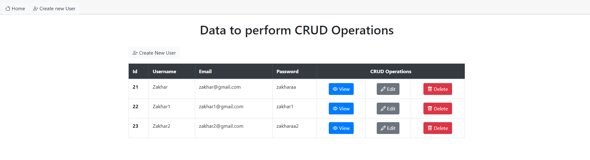
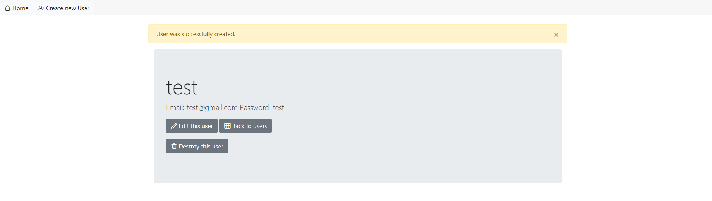
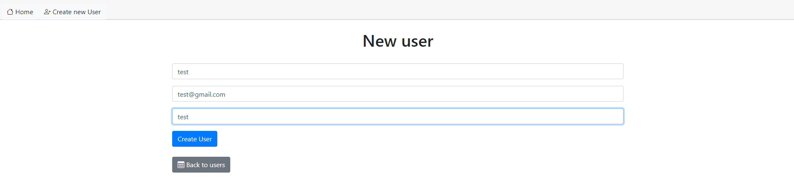
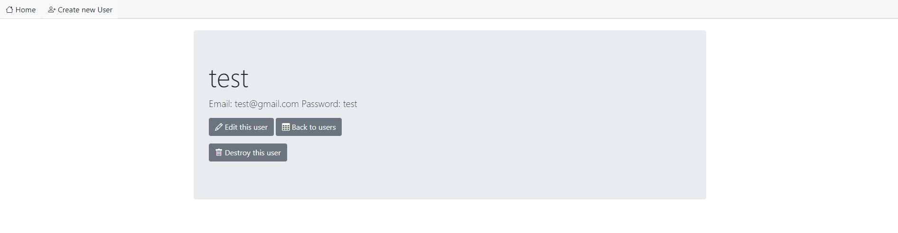
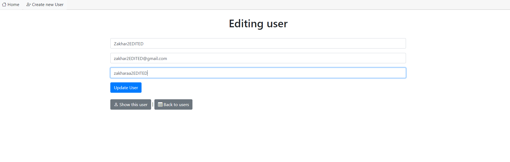

# README
Ruby on Rails version: Rails 7.0.3
Ruby version: ruby 3.1.2p20
Npm version: 8.5.5
sqlite3 version: 3.38.5
Gem version: 3.3.7

I'm run server on windows 10 so 
check Gemfile -> gem "turbo-rails"

Application link: http://127.0.0.1:3000/users

Create new user Link: http://127.0.0.1:3000/users/new

View : 

Delete user:

Edit user:

